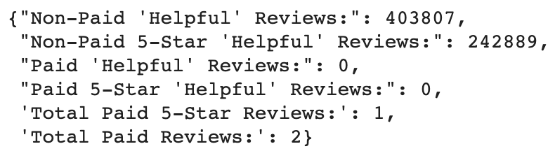

# Amazon_Vine_Analysis
## Analysis Overview
The purpose of this analysis was to extract and analyze records of Amazon.com reviews, in particular, to analyze the existence of possible positive bias in paid Vine reviewers vs non paid reviewers. The analysis used PySpark, via Google Colab and PostgresSql, to import and run the analyses on the data while communicating with an RDS hosted by AWS.    
While the code side of this analysis runs smoothly, it should be noted that upon deeper analysis the data set chosen for this project, the first set of reviews for Books, is legacy data primarily logged prior to the start of Amazon Vine program--which began in 2007.    
Therefore, the chief conclusion of the analysis, is that further data sets need to be examined in this category to discover whether such a bias exists in Vine reviewers. It was rewarding to explore PySpark (Google Colab), PostgresSQL and AWS working together despite the very real complication that can arise when working with older data. 

## Results
Below are the specific analysis questions that served as prompts for the project. Note that the numbers below, save for the last two in the summary, are not literal. The data was filtered from the raw data set by 'Helpful' reviews--reviews that received at least 20 helpful votes. Then, the data was filtered into 2 distinct data frames, each dataframe holding reviews from Vine/non Vine reviewers. 

- How many Vine reviews and non-Vine reviews were there?   
  As is provided in the summary dictionary that I compiled while exploring the data set, there were more than 400,000 non paid reviews and literally 2 Vine reviews in this set. 

    
    

- How many Vine reviews were 5 stars? How many non-Vine reviews were 5 stars?  
  *Literally* 1 Vine 5 star review (had to revisit the unfilterd original dataframe from Amazon to find any) & *242889* non-Vine 5 star reviews.

- What What percentage of Vine reviews were 5 stars? What percentage of non-Vine reviews were 5 stars?  
  *Ignoring the glaring issue of the data being Legacy*  
  **50%** of Vine reviews were 5 stars. **60.15%** of non-Vine reviews were 5 stars.

## Summary
While there may be positivity bias in the Vine reviewers, it cannot be supported or rejected through this analysis. While the scope of this project was adequate, the data set selected was not. My initial suspicion was there would not be positivity bias due to the pressure of being a paid reviewer and the need to present consistent, thorough reviews in order to maintain credibility among buyers and sellers, alike. Again, further analysis on more current data is the next step in investigating this conjecture.    
### Future Explorations
To Explore other sets of Amazon reviewer data from a variety of randomly-selected-product-genre data sets to rerun this analysis and explore the possibility of reviewer biases in Vine members across different platforms of goods. 

- *Is there a positivity bias in Vine members' reviews overall?*

- *Do any such biases change among different genres of products?* 

- *Are there consistent reviewers that over/under rate products or are 5 and 4 star reviews distributed randomly? 

- *Does the distribution of n-star reviews for specific genres/overall follow established distributions? (I.e. are they normally distributed? Non-parametric? And if so what kind?)*
